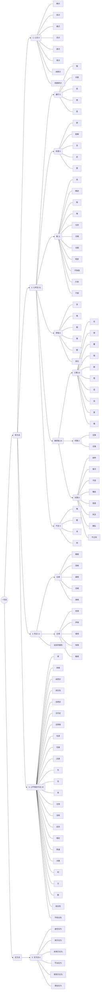

# 五位百法 - 全览图

此图展示了百法的完整分类体系。采用左向右的树状结构，以便于阅读。

```mermaid
graph LR
    Root((一切法))

    %% --- 有为法 ---
    Root --> YouWei(有为法)

    %% 1. 心法
    YouWei --> C1(1. 心法 8)
    C1 --- C1_1[眼识]
    C1 --- C1_2[耳识]
    C1 --- C1_3[鼻识]
    C1 --- C1_4[舌识]
    C1 --- C1_5[身识]
    C1 --- C1_6[意识]
    C1 --- C1_7[末那识]
    C1 --- C1_8[阿赖耶识]

    %% 2. 心所法
    YouWei --> C2(2. 心所法 51)
    
    C2 --> C2_1(遍行 5)
    C2_1 --- C2_1_1[触]
    C2_1 --- C2_1_2[作意]
    C2_1 --- C2_1_3[受]
    C2_1 --- C2_1_4[想]
    C2_1 --- C2_1_5[思]

    C2 --> C2_2(别境 5)
    C2_2 --- C2_2_1[欲]
    C2_2 --- C2_2_2[胜解]
    C2_2 --- C2_2_3[念]
    C2_2 --- C2_2_4[定]
    C2_2 --- C2_2_5[慧]

    C2 --> C2_3(善 11)
    C2_3 --- C2_3_1[信]
    C2_3 --- C2_3_2[精进]
    C2_3 --- C2_3_3[惭]
    C2_3 --- C2_3_4[愧]
    C2_3 --- C2_3_5[无贪]
    C2_3 --- C2_3_6[无嗔]
    C2_3 --- C2_3_7[无痴]
    C2_3 --- C2_3_8[轻安]
    C2_3 --- C2_3_9[不放逸]
    C2_3 --- C2_3_10[行舍]
    C2_3 --- C2_3_11[不害]

    C2 --> C2_4(烦恼 6)
    C2_4 --- C2_4_1[贪]
    C2_4 --- C2_4_2[嗔]
    C2_4 --- C2_4_3[痴]
    C2_4 --- C2_4_4[慢]
    C2_4 --- C2_4_5[疑]
    C2_4 --- C2_4_6[恶见]

    C2 --> C2_5(随烦恼 20)
    C2_5 --> C2_5_1(小随 10)
    C2_5_1 --- C2_5_1_1[忿]
    C2_5_1 --- C2_5_1_2[恨]
    C2_5_1 --- C2_5_1_3[覆]
    C2_5_1 --- C2_5_1_4[恼]
    C2_5_1 --- C2_5_1_5[嫉]
    C2_5_1 --- C2_5_1_6[悭]
    C2_5_1 --- C2_5_1_7[诳]
    C2_5_1 --- C2_5_1_8[谄]
    C2_5_1 --- C2_5_1_9[害]
    C2_5_1 --- C2_5_1_10[憍]

    C2_5 --> C2_5_2(中随 2)
    C2_5_2 --- C2_5_2_1[无惭]
    C2_5_2 --- C2_5_2_2[无愧]

    C2_5 --> C2_5_3(大随 8)
    C2_5_3 --- C2_5_3_1[掉举]
    C2_5_3 --- C2_5_3_2[昏沉]
    C2_5_3 --- C2_5_3_3[不信]
    C2_5_3 --- C2_5_3_4[懈怠]
    C2_5_3 --- C2_5_3_5[放逸]
    C2_5_3 --- C2_5_3_6[失念]
    C2_5_3 --- C2_5_3_7[散乱]
    C2_5_3 --- C2_5_3_8[不正知]

    C2 --> C2_6(不定 4)
    C2_6 --- C2_6_1[悔]
    C2_6 --- C2_6_2[眠]
    C2_6 --- C2_6_3[寻]
    C2_6 --- C2_6_4[伺]

    %% 3. 色法
    YouWei --> C3(3. 色法 11)
    C3 --> C3_1(五根)
    C3_1 --- C3_1_1[眼根]
    C3_1 --- C3_1_2[耳根]
    C3_1 --- C3_1_3[鼻根]
    C3_1 --- C3_1_4[舌根]
    C3_1 --- C3_1_5[身根]
    
    C3 --> C3_2(五境)
    C3_2 --- C3_2_1[色境]
    C3_2 --- C3_2_2[声境]
    C3_2 --- C3_2_3[香境]
    C3_2 --- C3_2_4[味境]
    C3_2 --- C3_2_5[触境]
    
    C3 --- C3_3[法处所摄色]

    %% 4. 心不相应行法
    YouWei --> C4(4. 心不相应行法 24)
    C4 --- C4_1[得]
    C4 --- C4_2[命根]
    C4 --- C4_3[众同分]
    C4 --- C4_4[异生性]
    C4 --- C4_5[无想定]
    C4 --- C4_6[灭尽定]
    C4 --- C4_7[无想报]
    C4 --- C4_8[名身]
    C4 --- C4_9[句身]
    C4 --- C4_10[文身]
    C4 --- C4_11[生]
    C4 --- C4_12[住]
    C4 --- C4_13[老]
    C4 --- C4_14[无常]
    C4 --- C4_15[流转]
    C4 --- C4_16[定异]
    C4 --- C4_17[相应]
    C4 --- C4_18[势速]
    C4 --- C4_19[次第]
    C4 --- C4_20[时]
    C4 --- C4_21[方]
    C4 --- C4_22[数]
    C4 --- C4_23[和合性]
    C4 --- C4_24[不和合性]

    %% --- 无为法 ---
    Root --> WuWei(无为法)
    WuWei --> C5(5. 无为法 6)
    C5 --- C5_1[虚空无为]
    C5 --- C5_2[择灭无为]
    C5 --- C5_3[非择灭无为]
    C5 --- C5_4[不动无为]
    C5 --- C5_5[想受灭无为]
    C5 --- C5_6[真如无为]
```
