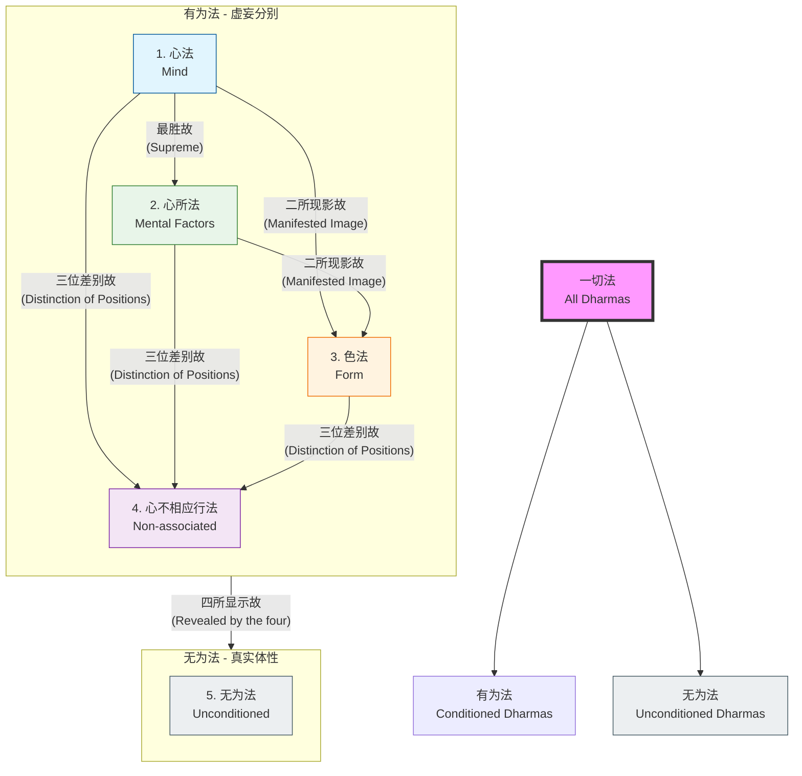

# 五位百法 - 逻辑关系图

此图展示了“一切法”如何展开为五位的逻辑过程。

## 逻辑说明

1.  **心法 (Mind)**: 在一切有为法中，心法起主导作用，如国王，故称“最胜”。
2.  **心所法 (Mental Factors)**: 恒常依随心法而起，如大臣随从国王，故称“与此相应”。
3.  **色法 (Form)**: 并非独立存在的实体，而是心与心所变现的影像，故称“二所现影”。
4.  **心不相应行法 (Non-associated)**: 既非色法也非心法，是在前三者的分位上假立的差别相，故称“三位差别”。
5.  **无为法 (Unconditioned)**: 前四种有为法灭除虚妄后所显示的真实理体，故称“四所显示”。
